[link](https://www.vertexshaderart.com/)

```bash
# 首次运行先生成 dll
npx webpack --config webpack.dll.config.js
# 开启 webpack 测试服务器
npx webpack-dev-server
```

# 1. point cloud vs spheres by Kabuto

nL6YpkW8YvGKNEKtj

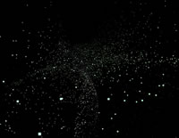

# 2. Bilinear Patch

mFr92RbhPmuJXKXWK

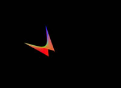

# 3. undul 👾

wFtvqKAQ3wB8Hho3p

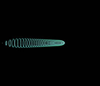

# 4. run 🌳🌲🎄🎋🌴

Yudd65BQfx92kHBcH

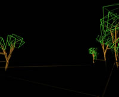

# 5. flwr

PFHJfQrt3knT8K8sQ

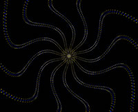

# 6. sbd

PponkZdtktgJHhipC

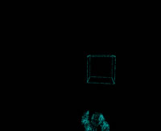

# 7. morp ⭕️⭕️⭕️⭕️⭕️⭕️⭕️

RnwjSt42YXLcGjsgT

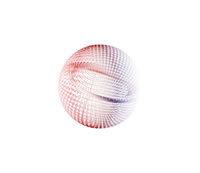

# 8. incId

SHEuL7KCpNnj28Rmn

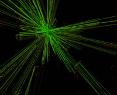

# 9. red ring

p9pecgaEBJ3kz5r7g


# 10. ung

9mqwFjEipb8pPtcPw

# 11. galax-z

ChgRzRLbrFD5wzfZk

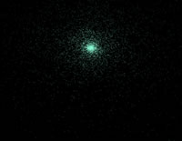

# 12. 3D Point Cloud Scene

kRguYk2Yft2HDLmiP

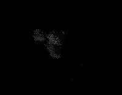

# 13. crazymusicbox

sS597q4aY9wEpneFz

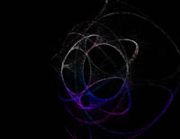

# 14. It's So In Vogue To Be Dead

Qh7WiD2iwnCrdfCXy

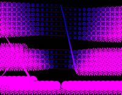

# 15. h-t

TZBvEoNYkzhB8PtQR

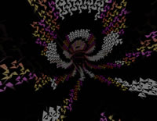

# 17. sdf-ish

Sx3Sk35wbBx2sGAxM

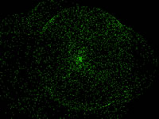